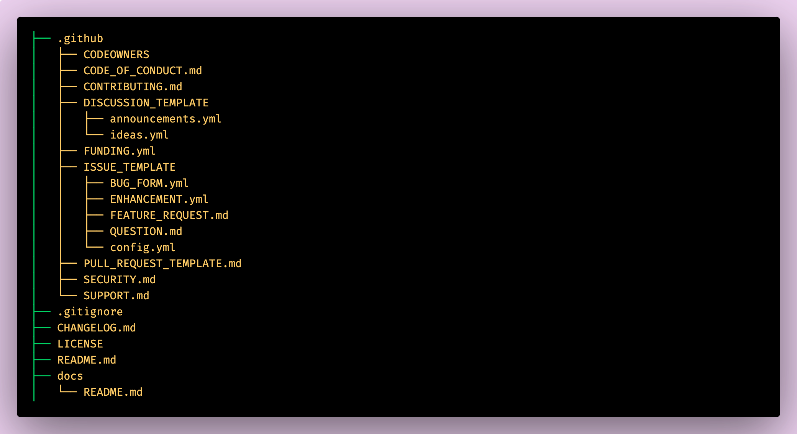

<!-- markdownlint-disable-file MD001 MD041 MD025 MD022 MD033-->

<!-- _backgroundColor: whitesmoke -->
<!--  _paginate: skip -->

# GitHub Health Files

> Sat, 24 August 2024 @GitTogether meetup

---

# About me

# _Keshav Mohta_

## SDE III / _J.P. Morgan Chase & Co._

> [xkeshav.com][blog]
> find me on `@xkeshav` on social media

---

# Agenda

- About _GitHub Health Files_
- Where / Which / What
- Role of package.json
- Template Repository
- Markdown / YAML Syntax
- A Live Demo
- QnA

---

# Health Files ?

<!-- _backgroundColor: white -->
<!-- _color: black -->

"Default community health files are a set of predefined files that provide guidance
and templates for maintaining a healthy and collaborative open source project."

~ <https://docs.github.com>

_They are essential for promoting transparency, good practices, and collaboration in open source projects._

---

# **Where** to keep these files?

- inside `.github/` folder
  - `.github/ISSUE_TEMPLATE/`
  - `.github/DISCUSSION_TEMPLATE/`
- on root of the directory
- Inside `docs/` folder

---

# **Which** are supported file types ?

- CAPS title with no extensions
  - README
  - LICENSE
  - CODEOWNERS
- Markdown (`.md`)
- YAML (`.yml`)

---

# **What** are the file names ?

- README`.md`
- CODE_OF_CONDUCT`.md`
- CONTRIBUTING`.md`
- SECURITY`.md`
- SUPPORT`.md`
- PULL_REQUEST_TEMPLATE`.md`
- _LICENSE_
- **ISSUE_TEMPLATE**/[ config`.yml` / kind`.md`]
- **DISCUSSION_TEMPLATE**/[ category`.yml` ]
- FUNDING`.yml`
- _CODEOWNERS_

---

## Folder Structure



---

# **Where** it display on GitHub

- On landing page of repository
- On _New Issue_ page
- Under _Pull Request_
- Under _Security_ tab
- Separate _Sponsor_ tab
- CodeOwner icon on file name
- On _Discussions_ page

---

# Role of _package.json_ file

```json name="package.json"
{
  "name": "@xkeshav/template",
  "version": "0.0.0",
  "license:": "MIT",
  "homepage": "https://github.com/xkeshav/template/blob/main/README.md",
  "bugs": {
    "url": "https://github.com/xkeshav/template/issues",
    "email": "xkeshav@gmail.com"
  },
  "repository": {
    "type": "git",
    "url": "https://github.com/xkeshav/template.git"
  },
  "author": "<Keshav Mohta>xkeshav@gmail.com"
}
```

- CHANGELOG.md
- Dependency Graph

---

# [**Markdown** syntax][markdown]

- Preview on browser and auto generated TOC
- link alias `[link][alias]` and later `[alias]: https://full/path/of/web/page`
- supported color code `#11ff22`
- emoji support `:shipit:`
- image insertion with full/relative path ``
- Syntax highlighting using \`\`\`language such as `ts`
- Table syntax

```md
| Left       | Center-aligned |      Right |
| :--------- | :------------: | ---------: |
| git status |   git status   | git status |
```

- Task List`[ ] [x]`
- Alerts `[!NOTE] [!TIP] [!IMPORTANT] [!WARNING] [!CAUTION]`

---

# [**YAML** Syntax][yaml]

- Space indented
- different meta data for markdown/input/dropdown
- Multiline with `|`
- Preview and Validity on Github itself

```yaml
name: Bug Report
description: Provide supporting details for a bug in development
body:
  - type: textarea
    attributes:
      label: What happened?
      description: |
        Please provide as much info as possible.
      placeholder: Tell us what you see!
    validations:
      required: true
```

---

# Template Repository

[xkeshav/template][template]

- need and use of template repository
- pre-defined health files
- _package.json_ boilerplate
- pre-defined templates for PR /discussion
- basic linting and formatting files
- IDE specific settings
- code snippets and project word dictionaries

---

# Live Demo

- Start from blank repo
- Pre suggested template by GitHub ( CODE_OF_CONDUCT / LICENSE )
- Display where these files are visible and linked.
- YML and Markdown syntax

[Open Source Guide][open-source]

---

<!-- _backgroundColor: white -->
<!-- _class: lead  -->

# Thanks


## Q & A ?

<!-- Reference -->

[blog]: https://www.xkeshav.com
[open-source]: https://opensource.guide/starting-a-project/
[markdown]: https://docs.github.com/en/get-started/writing-on-github/getting-started-with-writing-and-formatting-on-github/basic-writing-and-formatting-syntax
[yaml]: https://learnxinyminutes.com/docs/yaml/
[template]: http://www.github.com/xkeshav/template
